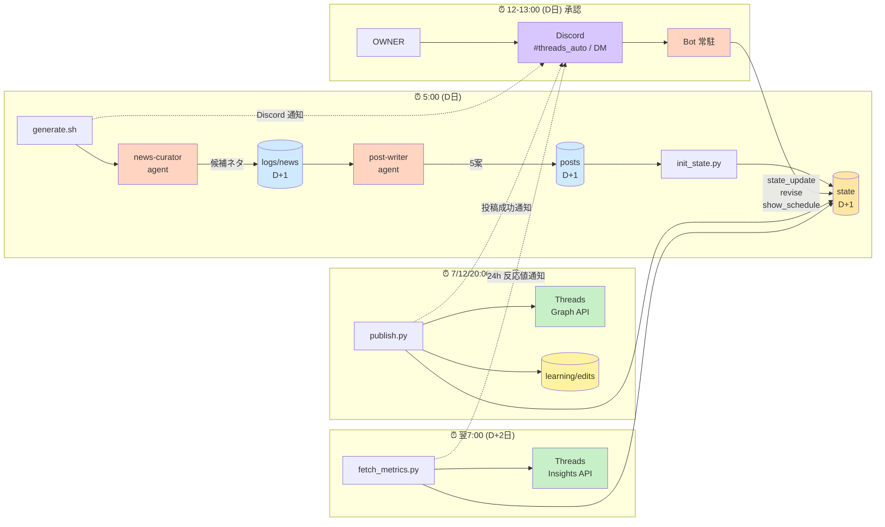
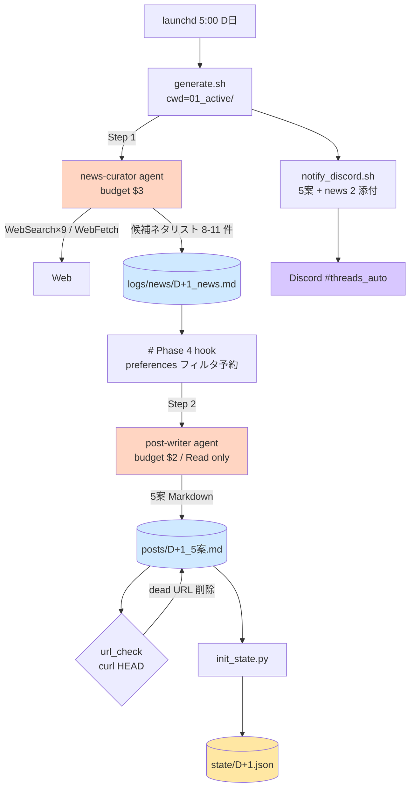
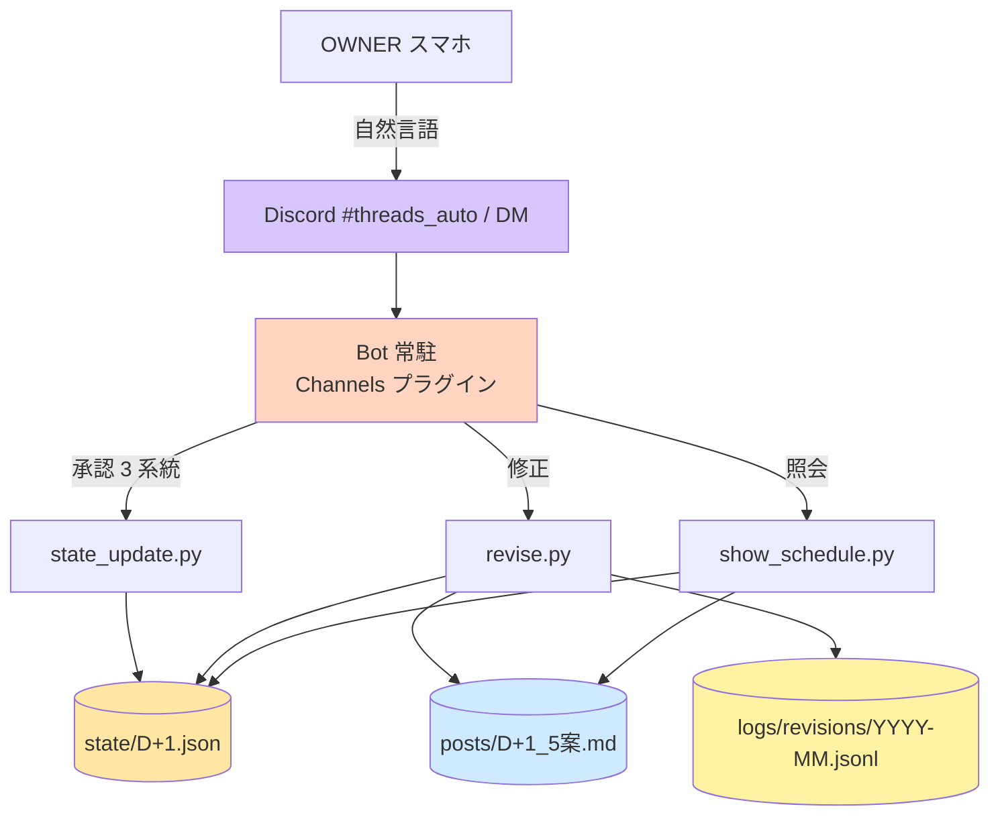
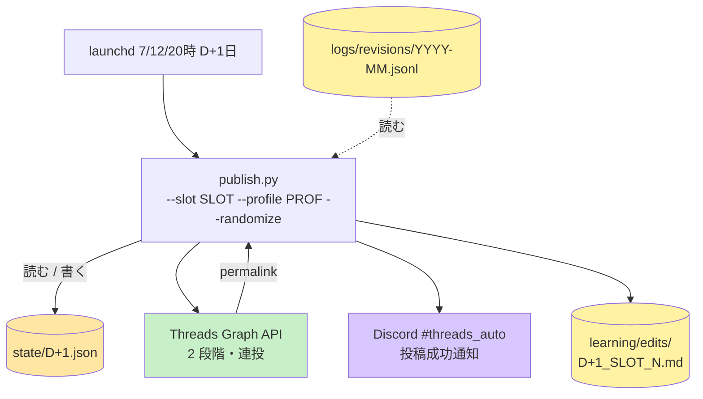
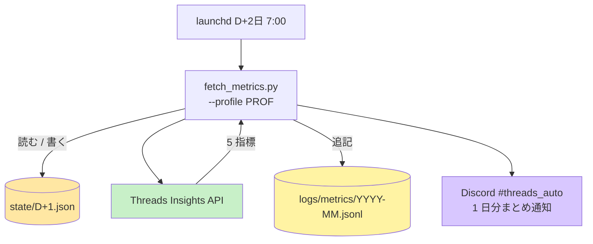
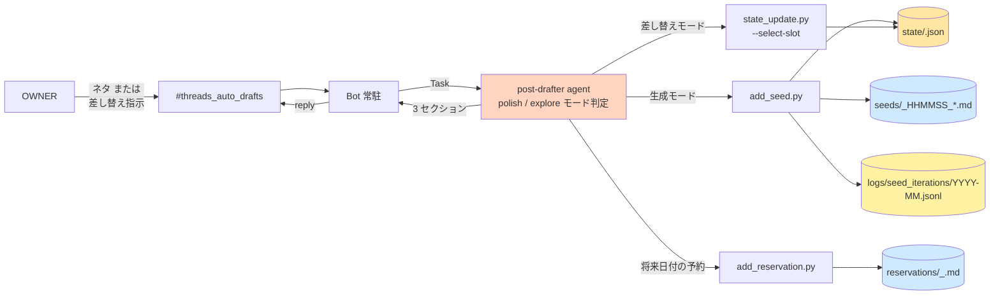
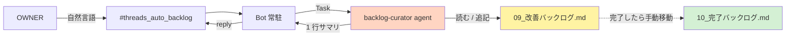
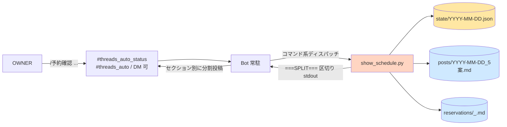
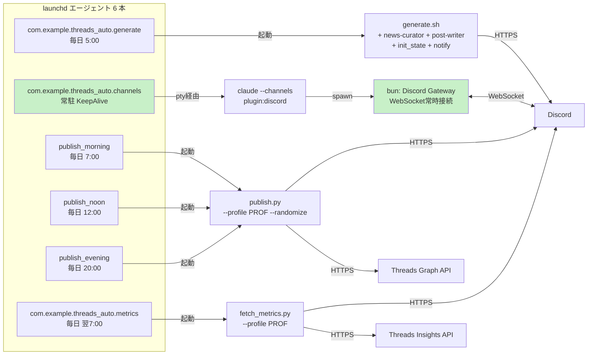

# 07 構成図

最終更新：2026-05-07
目的：threads_auto の現在の全体構成を、初見でも 5 分で把握できるように整理する

> 実装の履歴・Phase 進捗は本ファイルに書かない。`10_完了バックログ.md` と `git log` を参照。
> 旧版（Phase 追補スタイル）は git history に残置。

---

## 0. 全体像（1 枚絵）

「投稿 1 つが流れる過程」を 5:00 D日 → D+2 7:00 で示す。詳細は §2 時系列ストーリー、§3 別動線で深掘り。



**色の意味（全章共通）**：

- 🟡 黄濃：`state.json`（正本、複数プロセスが読み書き）
- 🟡 黄淡：append-only ログ・編集事例（`logs/revisions/`、`logs/seed_iterations/`、`logs/metrics/`、`learning/edits/`）
- 🔵 青：`posts/` / `seeds/` / `logs/news/` Markdown（生成物）
- 🟣 紫：Discord
- 🟢 緑：Threads / 常駐プロセス
- 🟠 オレンジ：Bot 本体・サブエージェント

### 日付セマンティクス（重要）

state / posts / reservations ファイル名の `YYYY-MM-DD` は **「3 投稿が実際に publish される日」**。承認操作（OWNER の Discord メッセージ）は **JST で「明日」の日付** を `--date` に渡す。

| 時刻 | 動作 | 対象 state |
|---|---|---|
| 5:00（D） | `generate.sh` → 翌日分の 5 案を `posts/<D+1>` + `state/<D+1>` に出力 | `state/<D+1>` 作成 |
| 12〜13:00（D） | OWNER が Discord で承認・修正 | `state/<D+1>` を Bot 経由で更新 |
| 翌 7/12/20:00（D+1） | `publish.py` が 3 投稿実施 | `state/<D+1>` 視点で「今日」 |
| 翌々 7:00（D+2） | `fetch_metrics.py` が D+1 投稿の 24h 反応値取得 | `state/<D+1>` にメトリクス書き戻し |

承認猶予：朝 18h / 昼 23h / 夜 31h。背景（夜=当日案への将来移行）は `09_改善バックログ.md` 参照。

---

## 1. サブエージェント早見表

threads_auto は 4 体のサブエージェントで責務分離している。**Bot 本体はチャンネル ID を見るだけ**で自然言語解釈はサブエージェントに委譲。

| エージェント | 起動経路 | 担当 | 入力 | 出力 | モデル | ツール |
|---|---|---|---|---|---|---|
| **news-curator** | `generate.sh` (5:00) | Step 1：ネタ収集 | 戦略系 + **直近 7 日の `learning/edits/*.md`（実投稿のみ）** Read | `logs/news/<D+1>_news.md`（候補 8〜11 件 + ソース）→ Discord 5 案通知に第 2 添付として同梱 | sonnet | Read / WebSearch / WebFetch / Glob / Grep |
| **post-writer** | `generate.sh` (5:00) | Step 2：5 案執筆 | 中間ファイル + 3 タイプ定義 Read | `posts/<D+1>_5案.md`（A〜C の 3 タイプ全てカバー / HEADER_RE 互換） | sonnet | Read のみ（Web 系遮断） |
| **post-drafter** | `#threads_auto_drafts` (Bot 経由) | 1 案下書き / スロット差し替え | OWNER のネタ・指示 + 戦略系 Read | `seeds/` 追加 → `state.candidates` 継ぎ足し or `state_update.py --select-slot` | sonnet | Read / Write / WebSearch / WebFetch / Bash |
| **backlog-curator** | `#threads_auto_backlog` (Bot 経由) | 改善案の整形・追記 | OWNER の自然言語改善案 | `09_改善バックログ.md` 末尾追記（重複検知あり） | sonnet | Read / Edit |

**4 体の特徴**：

- **cron 系（news-curator / post-writer）**：`generate.sh` が agent ファイル frontmatter を awk で抽出し、stdin pipe で `claude --print` に流す hybrid 方式。`--allowedTools` も frontmatter から動的取得
- **Bot 経由系（post-drafter / backlog-curator）**：Discord Bot が `Task` ツールで起動。`<repo_root>/.claude/agents/` 配下に置かれ Bot の cwd から自動ロード
- **5 案フロー（cron）とドラフト動線（Bot）は独立**：post-drafter は `posts/` には触らず `seeds/` に出力。`state.candidates[].source` フィールドで判別
- **革新的な Bot 設計**：「Bot 本体は channel_id ルーティングだけ。自然言語の解釈はチャンネル別サブエージェントに丸投げ」が拡張テンプレ

---

## 2. 時系列ストーリー（投稿 1 つができるまで）

### 2.1 5:00（D日）— 生成フェーズ

`launchd` が `generate.sh` を発火 → 2 段階の agent で **翌日分** の 5 案を作る。



**ポイント**：

- `TODAY=$(date +%F)` はログファイル名のみ。`TARGET_DATE=$(date -v+1d +%F)` が posts/state/reservations のファイル名
- Step 1 の出力（候補ネタリストの表行）が 8 行未満なら fail 検出 → 1 回再試行 → 不可なら exit
- **重複緩和の参照ソース**：news-curator は **直近 7 日の `learning/edits/*.md`（publish 成功時のみ生成、最大 21 ファイル = 3 slot × 7 日）** を Read。`posts/*_5案.md` は読まない（不採用案・修正前案を含むので「audience が見たもの」と乖離する）
- url_check は `curl -I -L --max-time 5` で 200/301/302 以外を dead 判定し、URL 行と直前の決まり文句行を削除。**プロンプトには検証ルールを書かない**（生成バイアス回避）
- **Discord 通知は 2 添付**：`posts/<D+1>_5案.md`（本体）と `logs/news/<D+1>_news.md`（news-curator の中間出力、ネタの妥当性確認用）を 1 メッセージにまとめて送信
- **テスト実行**：
  - `GENERATE_OUTPUT_DIR=test bash scripts/generate.sh` → 並走テスト（init_state / notify を skip、`logs/news/test/` `posts/test/` に出力）
  - `GENERATE_OUTPUT_DIR=test NOTIFY_IN_TEST=1 bash scripts/generate.sh` → E2E 動作確認（test ファイルを使って `[test]` プレフィックス付きで Discord 通知も流す）

### 2.2 12-13:00（D日）— 承認・修正・照会フェーズ

OWNER の Discord メッセージを Bot 常駐が解釈し、3 つの CLI のどれかを叩く。**承認・修正・照会すべて `--date <D+1>` 引き当て**。



**承認 CLI 3 系統**（`state_update.py`、自動選択は禁止・誤投稿防止）：

| 系統 | コマンド | 用途 |
|---|---|---|
| 3 案一括 | `--select 1,3,5` | 朝→昼→夜の固定割当で全部決める |
| 部分承認（非破壊） | `--select-slot evening=2` | 指定 slot のみ更新、未指定 slot は完全保持。時差承認 OK |
| 明示スキップ | `--skip-slot morning` | approval は触らずに特定 slot を skipped に |
| 全却下 / 全部スキップ | `--reject` / `--skip` | — |

published / publishing / failed / partially_published / reserved な slot は CLI 側で保護（上書き拒否）。

**修正 CLI**（`revise.py`、Phase 7c）：

- `--candidate N --instruction "..."` で 1 案を Claude に書き直しさせ、posts/ の N 番ブロック差し替え + `state.candidates[N-1].revisions[]` に追加
- **published 済 slot で使用中の N** → 拒否（die）。Threads は巻き戻せない
- **selected_ids に含まれる N（未投稿）** → revise + approval リセット + 該当 slot を pending に戻す
- **selected_ids に含まれない N** → revise のみ（副作用なし）
- 冪等：同 `--message-id` で 2 回叩いても 2 重修正されない
- 修正成功時に `logs/revisions/YYYY-MM.jsonl` に before/after セクションと指示文を追記

**照会 CLI**（`show_schedule.py`、Phase 7e）：

- `state.json` + `posts/` から「今日／明日の予約状況」を Discord 整形で出力
- `===SPLIT===` 区切り stdout → Bot が分割して別メッセージで投稿（Discord 2000 字制限対策）

### 2.3 7/12/20:00（D+1日）— 投稿フェーズ

`launchd` が `publish.py` を発火 → state を読んで Threads に投稿 → 成功時に編集事例ログを 1 ファイル / 案で出力。



**ポイント**：

- ±15 分ランダム発火ジッタ込み
- `publish.py` 視点では「今日（D+1）」の state を読むだけ。state ファイル日付 = 投稿日のおかげで日付セマンティクス変更時に publish.py / fetch_metrics.py は無改修で済んだ
- `source` 付き candidate（seed）も通常 5 案も同じ経路で投稿
- **編集事例の自動保存**：投稿成功直後に `save_edit_case()` が `learning/edits/<date>_<slot>_<candidate_id>.md` を 1 ファイル / 案で出力。`logs/revisions/*.jsonl` から該当 candidate の修正履歴を引き、3 段階（**初稿** / **修正履歴チェーン** / **決定版（実投稿本文）**）+ メタ（channel / source_type / type / source / revision_count / permalink / profile）で Markdown 化
- `channel` は candidate.type から導出（A〜C 型 → `threads_auto`、`seed-*` → `threads_auto_drafts`、`reservation` → `manual`）
- 書き込み失敗は warn のみで publish 自体は成功させる（フィードバックログは付帯機能）

### 2.4 翌 7:00（D+2日）— 反応値取得フェーズ

`launchd` が `fetch_metrics.py` を発火 → 前日 published slot の 24h 反応値を Threads Insights から取得。



**ポイント**：

- 5 指標 = views / likes / replies / reposts / quotes
- 取得対象：`status==published` & `profile==--profile引数` & `metrics_24h is None` & `published_at` が 24h〜7 日前
- 冪等：dict なら取得済みとしてスキップ。失敗時は null のまま翌日再対象化、7 日経過後は諦める
- 24h 反応値は **state + jsonl + Discord の 3 経路**で残す（読み出し / 集計 / 即時確認の用途別）
- 詳細：`10_完了バックログ.md`「投稿分析パイプライン Phase 1：24h 反応データ取得（fetch_metrics）」（後続 Phase 2/3 は `09_改善バックログ.md`「投稿分析パイプライン」）

---

## 3. 別動線（5 案フローと独立）

### 3.1 ドラフト動線（`#threads_auto_drafts`）

5 案にない題材を OWNER が思いついた時の系統。`post-drafter` が 1 案を生成して `seeds/` に保存し、「朝にこれで」「明後日の昼に」等の指示でスロット差し替え。



**post-drafter のモード**：

| モード | トリガ | 動作 |
|---|---|---|
| **polish**（生成） | 事実が揃っており構成整えるだけ | WebSearch なしで 1 案生成 → `add_seed.py` で seeds/ 追加 |
| **explore**（生成） | 調査・角度出し必要 | WebSearch 最大 3 回 → `add_seed.py` |
| **swap**（差し替え） | 「朝にこれで」「夜に差し替え」「明日の昼に」等 | `state_update.py --select-slot` で該当 slot に。state がない将来日付なら `add_reservation.py` |

**前提**：

- 5 案（`posts/`）には触らない。`revise.py` も呼ばない
- `--select`（3 案一括）は使わず `--select-slot` のみ
- LOCKED slot（published / publishing / failed / partially_published / reserved）は絶対上書きしない
- **`approved` slot は上書き OK**（2026-05-07 〜）：「`1,3,5で確定` 後に NotebookLM など特定ネタを drafter で後乗せしたい」のような後乗せシナリオを許容。返信時に「元は案 N でしたが seed-M に差し替えました」と明示
- `add_seed.py` 呼び出し時に `--raw-instruction "<原文>"` を毎回渡し、iteration の場合は `--parent-seed-id <N>` も渡す（`logs/seed_iterations/` で系譜を残す）

### 3.2 バックログ収集（`#threads_auto_backlog`）

OWNER の改善アイデアを `09_改善バックログ.md` にフォーマット統一して追記する系統。



**ポイント**：

- 起票日 / 現状 / やりたいこと / ユースケース のフォーマットに整形して追記
- 重複検知あり（既存項目とのマージ提案）
- 09 には未着手のみ、完了は項目ごと 10 へ手動移動。重複判定対象は 09 のみ
- Bot 側 UX：起動直後に 🤔 リアクション → 完了後に `✅ バックログ追加：◯◯` を reply

### 3.3 予約確認（`/予約確認` スラッシュコマンド）

「今日／明日に何が予約されているか」を Discord で確認するための照会動線。承認・修正には触らず読み取り専用。**サブエージェントは経由せず Bot 本体が `show_schedule.py` を直叩き**して整形済み出力をそのまま貼る。



**コマンド体系**：

| 入力 | 処理 |
|---|---|
| `/予約確認` | `show_schedule.py --range today,tomorrow`（デフォルト：今日 + 明日） |
| `/予約確認 今日` `/予約確認 today` | `--date today` |
| `/予約確認 明日` `/予約確認 tomorrow` | `--date tomorrow` |
| `/予約確認 YYYY-MM-DD` | `--date YYYY-MM-DD` |

**受付チャンネル**：

| channel | 受付 | 備考 |
|---|---|---|
| `#threads_auto_status`（照会専用、id `${DISCORD_STATUS_CHANNEL_ID}`） | `/` で始まるコマンドのみ | `/` 以外（自然言語）は完全無視。承認・修正は受け付けない |
| `#threads_auto`（id `${DISCORD_APPROVAL_CHANNEL_ID}`） | `/予約確認` 受付可 | 承認・修正と同じチャンネルだがコマンド扱いで分岐 |
| DM | `/予約確認` 受付可 | 外出先用 |
| `#threads_auto_drafts` / `#threads_auto_backlog` | 受け付けない | チャンネル分離の意味を保つ |

**出力フォーマット**（`show_schedule.py` の責務）：

- stdout を `\n\n===SPLIT===\n\n` 区切りで複数セクション化（Discord 2000 字制限対策）
- セクション 1：朝/昼/夜のサマリ一覧 + 承認状態
- セクション 2 以降：投稿済（permalink）または予約中の各 slot ごとに 1 セクション（案メタ + 本文）
- 末尾：`--date` モードでは「📅 明日以降の予約」一覧 + 各予約 1 セクション（`--no-future` で抑制可、`--range` モードでは出ない）
- ヘッダ文言は date が JST 今日 → 「今日の予約」、明日 → 「明日の予約」、それ以外 → 「予約」と自動切替

**前提**：

- 読み取り専用。state.json / posts/ / reservations/ には書き込まない（fcntl.flock も不要）
- 自然言語パースに**フォールバックしない**（`/予約確認だけど5,3,1で` のような曖昧入力で誤動作するのを防ぐ）
- 未対応コマンドは `⚠ 未対応のコマンドです。例：/予約確認, /予約確認 明日` と 1 行返す
- state ファイル無しの将来日付でも die せず、その日付の `reservations/` を拾って表示

---

## 4. 設計上のキーポイント

実装が整合性を保つために守っている不変条件群。改修時はここを破らないか確認する。

1. **state.json が正本**：`generate` / `state_update` / `revise` / `add_seed` / `publish` / `fetch_metrics` の 6 者がここを読み書きして整合性を保つ。`fcntl.flock` で排他更新。冪等性（`status == published` なら何もしない）と部分復旧（`partially_published` から再開）を担保

2. **Discord は送受信が別経路**：
   - **送信**：Bot Token API 直叩き（`notify_discord.sh` シェル、Python `requests`）
   - **受信**：Channels プラグインの常駐 Bot が DM/チャンネルの返信を Claude Code セッションに push

3. **承認は明示 CLI 経由のみ・3 系統対応**（誤投稿防止）：詳細は §2.2

4. **修正は `revise.py` 経由のみ**：詳細は §2.2

5. **ドラフト動線は 5 案フローと独立**：詳細は §3.1

6. **テスト用プロファイル分離**：`--profile test` で `${THREADS_TEST_USERNAME}` に投稿、`--profile production` で `@${THREADS_USERNAME}` に投稿。plist では明示指定が必要（事故防止のため空文字 fallback なし）。`switch_profile.sh` で 4 plist 一括切替

7. **URL 死活チェックは生成と分離**：`generate.sh` の `url_check()` 関数が、Step 2 出力後 / `init_state.py` 前に走る。プロンプトには検証ルールを書かない（生成バイアス回避）

8. **24h 反応値は state + jsonl + Discord の 3 経路**：詳細は §2.4

9. **編集フィードバックログは 3 ファイル分離 + 1 統合**：
   - **生フィードバック層**（チャンネル別、編集セマンティクスが構造的に異なるため分離）：
     - `logs/revisions/YYYY-MM.jsonl`：`#threads_auto` 系（差分ベース、`revise.py` が追記）
     - `logs/seed_iterations/YYYY-MM.jsonl`：`#threads_auto_drafts` 系（全文再生成ベース、`add_seed.py` が追記、`parent_seed_id` で系譜を残す）
   - **統合層**：`learning/edits/<date>_<slot>_<candidate_id>.md`（両チャンネル共通スキーマで 3 段階 + メタ）
   - 冪等性：revise.py の `--message-id` 重複時はログ書かない / add_seed.py 同様 / learning/edits は publish 成功時に都度上書き
   - 書き込み失敗時：warn のみで親 CLI 自体は成功させる
   - **読む側の予定**：`analyze_edits.py`（未着手）が `learning/edits/*.md` を主ソースに集計してプロンプト改善案を出す（`09_改善バックログ.md` 参照）

10. **5 案生成は 2 段階 agent パイプライン**：詳細は §1 早見表 + §2.1

11. **照会動線はサブエージェント経由しない・読み取り専用**（`/予約確認`、§3.3）：承認・修正と違い state を変更しないため、Bot 本体が `show_schedule.py` を直叩きする最短経路。スラッシュコマンド `/` プレフィックスで自然言語パースから完全分離（曖昧入力で誤動作するのを防ぐ）。受付チャンネルは照会専用 / `#threads_auto` / DM の 3 つ

---

## 付録 A. state.json スキーマ（要約）

詳細は `state/example.json` 参照。

```json
{
  "schema_version": 1,
  "date": "2026-05-04",
  "status": "waiting_approval | approved | partially_published | published | skipped",
  "generation_id": "2026-05-04-0500-001",
  "generated_at": "ISO8601",
  "post_file": "posts/2026-05-04_5案.md",
  "discord": {
    "channel_id": "...",
    "message_id": "...",
    "thread_id": null,
    "approval_message_id": null
  },
  "candidates": [
    {
      "id": 1,
      "type": "A",
      "format": "2本スレッド",
      "intensity": "強",
      "theme": "...",
      "content_hash": null,
      "status": "candidate | approved | rejected",
      "revisions": [],
      "source": null
    }
    // ... 5 candidates、または seed が追加されると id=6,7,... と続く
    // seed の場合は source: "seeds/2026-05-04_HHMMSS_slug.md" が入る
  ],
  "slots": {
    "morning":  { "candidate_id": 1, "status": "...", "scheduled_at": "07:00", "metrics_24h": null, ... },
    "noon":     { "candidate_id": 3, "status": "...", "scheduled_at": "12:00", "metrics_24h": null, ... },
    "evening":  { "candidate_id": 5, "status": "...", "scheduled_at": "20:00", "metrics_24h": null, ... }
  },
  "approval": {
    "approved": false,
    "approved_at": null,
    "approved_by": null,
    "approval_message": null
  },
  "history": [
    // {event: "slots_modified" | "seed_added" | "revised" | "published" | "partially_published" | "failed" | ... , at: "...", actor: "discord", ...}
  ]
}
```

`metrics_24h` は dict（`{views, likes, replies, reposts, quotes, fetched_at}`）または null。

`history[]` は state ファイル単位の操作監査用。月次集計用の独立フィードは別ファイル：

- `logs/revisions/YYYY-MM.jsonl`（修正イベント）
- `logs/seed_iterations/YYYY-MM.jsonl`（seed 生成・iteration）
- `logs/metrics/YYYY-MM.jsonl`（24h 反応値）

将来予定：`logs/explore_iterations/*.jsonl` / `logs/approvals/*.jsonl`。

---

## 付録 B. ディレクトリ構成

```
__REPO_ROOT__/   # threads_auto/
├── repo/01_active/
│   ├── posts/                              # 5 案出力（generate.sh / post-writer 生成）
│   ├── seeds/                              # post-drafter が生成した 1 案下書き
│   ├── reservations/                       # 将来日付の事前予約
│   ├── state/                              # ★正本（state machine）
│   ├── learning/edits/                     # 編集事例集（publish.py が出力）
│   ├── scripts/
│   │   ├── generate.sh          # 5:00 起動。news-curator → post-writer → url_check → init_state → notify
│   │   ├── generate_legacy.sh   # 旧 1 段階版（rollback 用）
│   │   ├── init_state.py        # posts/ → state/ 初期化
│   │   ├── state_update.py      # 承認 CLI（--select / --select-slot / --skip-slot / --reject / --skip）
│   │   ├── revise.py            # 修正 CLI + logs/revisions/*.jsonl 追記
│   │   ├── show_schedule.py     # 予約状況照会 CLI（===SPLIT=== 区切り stdout）
│   │   ├── add_seed.py          # seeds 登録 CLI + logs/seed_iterations/*.jsonl 追記
│   │   ├── add_reservation.py   # 将来日付予約 CLI
│   │   ├── apply_reservations.py # init_state.py から呼ばれ、reservations/ を state に取り込む
│   │   ├── publish.py           # 7:00/12:00/20:00 投稿 + learning/edits/*.md 出力
│   │   ├── fetch_metrics.py     # 翌 7:00 反応値取得 + jsonl + Discord 通知
│   │   ├── switch_profile.sh    # publish×3 + metrics の 4 plist の --profile を一括切替
│   │   └── notify_discord.sh    # Bot Token で #threads_auto に投稿
│   ├── launchd/                            # plist 6 本（~/Library/LaunchAgents/ に bootstrap 済）
│   ├── logs/
│   │   ├── news/                           # news-curator 中間出力（YYYY-MM-DD_news.md）
│   │   ├── metrics/                        # YYYY-MM.jsonl
│   │   ├── revisions/                      # YYYY-MM.jsonl
│   │   └── seed_iterations/                # YYYY-MM.jsonl
│   ├── bk/                                 # 退役プロンプト類
│   ├── 01_運用方針.md
│   ├── 05_自動化ロードマップ.md
│   ├── 06_自動化ロードマップ_設計フィードバック.md  # （旧、現在は 09 に集約）
│   ├── 07_構成図.md             ← この資料
│   ├── 09_改善バックログ.md     # 未着手（投稿分析 Phase 2/3 含む）
│   └── 10_完了バックログ.md     # 完了済み（投稿分析 Phase 1 含む）
├── .claude/
│   └── agents/                             # サブエージェント定義群（4 体）
│       ├── backlog-curator.md              # #threads_auto_backlog 担当
│       ├── post-drafter.md                 # #threads_auto_drafts 担当
│       ├── news-curator.md                 # generate.sh Step 1
│       ├── post-writer.md                  # generate.sh Step 2
│       └── ref/                            # agent が runtime で Read する依存ファイル
│           └── 02_5タイプ定義_厚み版.md     # post-writer 専用（git 管理外 / 中身は 3 タイプ A〜C、ファイル名は履歴互換のため据え置き）
├── CLAUDE.md                               # Bot 規範（channels セッションの system prompt）
├── .env                                    # APIキー類（.gitignore）
└── .venv/                                  # Python venv

~/.claude/
├── channels/discord/.env        # DISCORD_BOT_TOKEN（perms 600）
├── settings.json                # permissions.allow に discord 5 ツール許可
└── plugins/.../discord@0.0.4    # 公式プラグイン

~/Library/LaunchAgents/          # launchd plist（実体）
├── com.example.threads_auto.generate.plist
├── com.example.threads_auto.channels.plist
├── com.example.threads_auto.publish_morning.plist
├── com.example.threads_auto.publish_noon.plist
├── com.example.threads_auto.publish_evening.plist
└── com.example.threads_auto.metrics.plist
```

---

## 付録 C. launchd plist 一覧

`launchctl list | grep example.threads_auto` で見える 6 つのジョブ。



| 名前 | 発火 | コマンド | 対象 state |
|---|---|---|---|
| `com.example.threads_auto.generate` | 5:00 | `generate.sh`（**翌日分**を生成） | `state/<D+1>.json` を作成 |
| `com.example.threads_auto.channels` | 常駐 | `script -q /dev/null claude --channels plugin:discord` | — |
| `com.example.threads_auto.publish_morning` | 7:00 + ±15 分 | `publish.py --slot morning --profile PROF --randomize` | `state/<D>.json` |
| `com.example.threads_auto.publish_noon` | 12:00 + ±15 分 | `publish.py --slot noon --profile PROF --randomize` | `state/<D>.json` |
| `com.example.threads_auto.publish_evening` | 20:00 + ±15 分 | `publish.py --slot evening --profile PROF --randomize` | `state/<D>.json` |
| `com.example.threads_auto.metrics` | 7:00 | `fetch_metrics.py --profile PROF` | `state/<D-1>.json`（前日投稿の 24h 反応値） |

`PROF` = `test` or `production`。`switch_profile.sh` で 4 plist 一括切替。

**ポイント**：

- 緑（`channels` と `bun`）だけが常駐。残り 5 つは定刻発火のワンショット
- `channels` は `pty` 経由でないと `--print` モードで即死（`learning_claude_channels_launchd.md` 参照）
- `bun` は Discord Gateway へ WebSocket 常時接続。Mac 再起動を跨いでも `KeepAlive: true` で自動復元
- `metrics` は `publish_morning` と同じ 7:00 発火だが、対象は **前日の published slot**（24h 経過後）。発火順は同時でも内部処理は独立

### 確認コマンド

```bash
launchctl list | grep example.threads_auto                        # 一覧（pid / last exit / label）
launchctl print gui/$UID/com.example.threads_auto.NAME            # 単体詳細
launchctl kickstart -k gui/$UID/com.example.threads_auto.NAME     # 手動発火
launchctl bootstrap gui/$UID ~/Library/LaunchAgents/com.example.threads_auto.NAME.plist
launchctl bootout   gui/$UID/com.example.threads_auto.NAME
```

---

## 付録 D. Discord チャンネル / .env

### Discord チャンネル構成

| channel_id | 名前 | 用途 | 受け手 |
|---|---|---|---|
| `${DISCORD_APPROVAL_CHANNEL_ID}` | `#threads_auto` | 5 案通知・承認・修正・照会・投稿成功通知・反応値通知 | Bot 本体（`state_update.py` / `revise.py` / `show_schedule.py`） |
| `${DISCORD_BACKLOG_CHANNEL_ID}` | `#threads_auto_backlog` | 改善案の投げ込み | `backlog-curator` サブエージェント |
| `${DISCORD_DRAFTS_CHANNEL_ID}` | `#threads_auto_drafts` | 投稿ネタ・テーマ → 1 案生成 → スロット差し替え | `post-drafter` サブエージェント |
| `${DISCORD_STATUS_CHANNEL_ID}` | 照会専用（status） | `/予約確認` 等のスラッシュコマンド専用 | Bot 本体（コマンド系のみ） |
| DM（OWNER との 1:1） | — | 外出先用バックアップ。**承認・修正のみ**（バックログ・ドラフトは DM では受けない） | Bot 本体 |

Bot は **最初に必ず channel_id を見て分岐**する。承認系のロジック（`1,3,5` パース等）はバックログ・ドラフトチャンネルでは一切実行しない。

### .env の中身（key 一覧、値は伏せる）

| key | 用途 |
| --- | --- |
| `ANTHROPIC_API_KEY` | （未使用、claude --print は claude.ai サブスク認証） |
| `DISCORD_BOT_TOKEN` | Discord Bot 共通 |
| `DISCORD_CHANNEL_ID` | `#threads_auto = ${DISCORD_APPROVAL_CHANNEL_ID}` |
| `THREADS_ACCESS_TOKEN` | @${THREADS_USERNAME}（本番）長期トークン |
| `THREADS_USER_ID` | @${THREADS_USERNAME} の user_id |
| `THREADS_TEST_ACCESS_TOKEN` | ${THREADS_TEST_USERNAME}（テスト）長期トークン |
| `THREADS_TEST_USER_ID` | `${THREADS_TEST_USER_ID}` |

---

## 付録 E. テスト用環境変数 / フラグ

`generate.sh` / `publish.py` / `fetch_metrics.py` の動作を本番に干渉せず確認するための切替手段。

| 変数 / フラグ | 対象スクリプト | 効果 |
|---|---|---|
| `GENERATE_OUTPUT_DIR=test` | `generate.sh` | 出力先を `logs/news/test/` + `posts/test/` に切替、`init_state` / `notify_discord` を skip |
| `GENERATE_OUTPUT_DIR=test NOTIFY_IN_TEST=1` | `generate.sh` | 上記に加えて Discord 通知も実行（`[test]` プレフィックス付き、test ファイルを 2 添付） |
| `--profile test` | `publish.py` / `fetch_metrics.py` | `@${THREADS_TEST_USERNAME}`（テストアカウント）に投稿、本番 `@${THREADS_USERNAME}` には触らない |
| `--profile production` | `publish.py` / `fetch_metrics.py` | 本番 `@${THREADS_USERNAME}` に投稿（明示指定が必須・空文字 fallback なし＝事故防止） |
| `--dry-run` | `publish.py` | Threads API 呼び出しを skip。本文生成・state 検証のみ（`learning/edits/*.md` の出力もなし） |
| `--date YYYY-MM-DD` | `state_update.py` / `revise.py` / `show_schedule.py` / `publish.py` / `fetch_metrics.py` / `add_reservation.py` | 対象 state を明示。**省略すると JST 今日**（テストでは必ず明示すること、本番 state 改変リスク） |

### よくある組み合わせ

```bash
# 5 案生成 E2E + Discord 通知の見た目確認（本番に干渉なし）
GENERATE_OUTPUT_DIR=test NOTIFY_IN_TEST=1 bash scripts/generate.sh

# テストアカウントに投稿テスト（state は本番 state を読むので --date 明示推奨）
python3 scripts/publish.py --slot morning --profile test --date 2026-05-08

# Threads に投稿せず動作だけ確認
python3 scripts/publish.py --slot morning --profile test --date 2026-05-08 --dry-run

# 24h 反応値の取得テスト
python3 scripts/fetch_metrics.py --profile test
```

### 並走テストの隔離レベル

| レベル | コマンド | 本番への影響 |
|---|---|---|
| 完全隔離 | `GENERATE_OUTPUT_DIR=test bash scripts/generate.sh` | なし（出力もファイル、Discord も触らない） |
| Discord のみ流す | `GENERATE_OUTPUT_DIR=test NOTIFY_IN_TEST=1 bash scripts/generate.sh` | Discord に `[test]` メッセージ 1 通（後で削除可） |
| プロファイル切替 | `--profile test` | テストアカウント `@${THREADS_TEST_USERNAME}` 側に投稿。本番 `@${THREADS_USERNAME}` は完全保護 |
| 危険ゾーン | `--date` 省略 + `--profile production` | **本番 state 改変・本番投稿のリスク**。テスト時は両方明示すること |

---

## 関連

- 運用方針：`01_運用方針.md`
- 3 タイプ定義（厚み版）：`.claude/agents/ref/02_5タイプ定義_厚み版.md`（post-writer agent と同居 / 2026-05-18 に 5→3 タイプ統合、ファイル名は履歴互換のため据え置き）
- ロードマップ：`05_自動化ロードマップ.md`
- 設計フィードバック（誤投稿防止の出典）：`06_自動化ロードマップ_設計フィードバック.md`
- 改善バックログ：`09_改善バックログ.md`（未着手）／ `10_完了バックログ.md`（完了済み）
  - 投稿分析パイプライン（Phase 1 完了 / Phase 2 週次サマリ / Phase 3 コンサル）：`09_改善バックログ.md`「投稿分析パイプライン（取得 → 集計 → コンサル）」
- state.json 実例：`state/example.json`
- Bot 規範：`__REPO_ROOT__/CLAUDE.md`
- サブエージェント定義（4 体）：
  - `<repo_root>/.claude/agents/news-curator.md`（cron Step 1）
  - `<repo_root>/.claude/agents/post-writer.md`（cron Step 2）
  - `<repo_root>/.claude/agents/post-drafter.md`（Bot 経由 / `#threads_auto_drafts`）
  - `<repo_root>/.claude/agents/backlog-curator.md`（Bot 経由 / `#threads_auto_backlog`）
